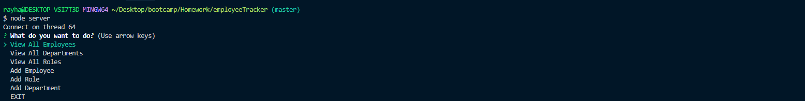
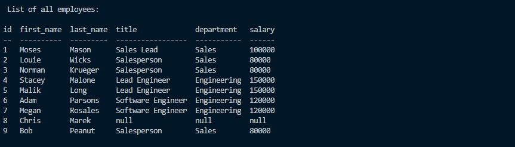

# Employee Tracker
## Description
  This application allows users to keep track of employee data and also add new data.
## Table of Contents
1.[Usage](#Usage)

2.[Contribution](#Contribution)

3.[Questions](#Questions)

Users are prompt with a selection of choices to navigate through app.

For example, one option is to see a list of current employees.

## Istallation Requirements
    npm express
    npm mysql
    npm console.table
## Usage
    Users who need to keep track of current employees while also having the feature to add new employees
## License

## Contribution
    Feel free to contact Ray's GitHub
## Video Demo Link
   https://youtu.be/JRg_BYJhgPw
## Questions
If you have any questions, please contact my GitHub(https://github.com/rnguyen7388) or send me an email at rnguyen7388@gmail.com
